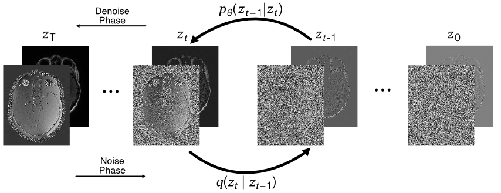

# Complex Valued Diffusion for MRI phase generation

This is the implementation of a complex valued Diffusion model for the generation of MRI phase data in the image domain, dependent on the magnitude image.

The model utilizes the underlying cResUNet architecture used for k-Strip with an additional positional embedding for the diffusion timesteps _t_.

## Theory



The model will inject complex valued noise in the form of
$$\beta = 1 \cdot e^{i \angle\psi}$$
with $\psi$ being gaussian noise.

This noise mainly influences the phase of the complex valued input $z$, but also partially the magnitude:

$$
z_{noised} = z_0 \cdot \sqrt{\alpha} + \beta \cdot \sqrt{1-\alpha}
$$

with $\alpha_t:=1-\beta_t$.

The model will then learn to predict the noise in each timestep.

During sampling, the model will use the magnitude image and pure noise as its phase to generate a complex valued image with the original magnitude and a generated phase.

## Usage
### Training
To train the model, execute the `train_complexDiff.py` script with the appropriate configuration and flags:

```bash
python train_complexDiff.py [flag]
```
### Command Line Arguments

| Argument            | Type | Default               | Description                                             |
|---------------------|------|-----------------------|---------------------------------------------------------|
| `--e`               | int  | `50`                  | Number of epochs for training                           |
| `--log`             | str  | `INFO`                | Define debug level. Defaults to INFO.                   |
| `--tqdm`            | flag | `False`               | If set, do not log training loss via tqdm.              |
| `--gpu`             | int  | `0`                   | GPU used for training.                                  |
| `--config`          | str  | `train_resunet2d.yaml`| Path to configuration file                              |
| `--c`               | flag | `False`               | Continue from best checkpoint.                          |


Ensure all dependencies are installed and the dataset path is correctly specified in the configuration file.

### Sampling

To sample your own raw data, exectue the `sample_phase.py` script. The input data needs to be saved as .pt or .npy data and should be in the shape 256 x 256, larger shapes will be cropped.

```bash
python sample_phase.py [flag]
```

### Command Line Arguments

| Argument            | Type | Default               | Description                                             |
|---------------------|------|-----------------------|---------------------------------------------------------|
| `-m`                | str  | `None`                | Path to the model directory.                            |
| `-i`                | str  | `None`                | Path to the data directory. Data needs to be in .pt or .npy format.  |
| `-p`                | str  | `None`                | Path to the save directory. tqdm.              |
